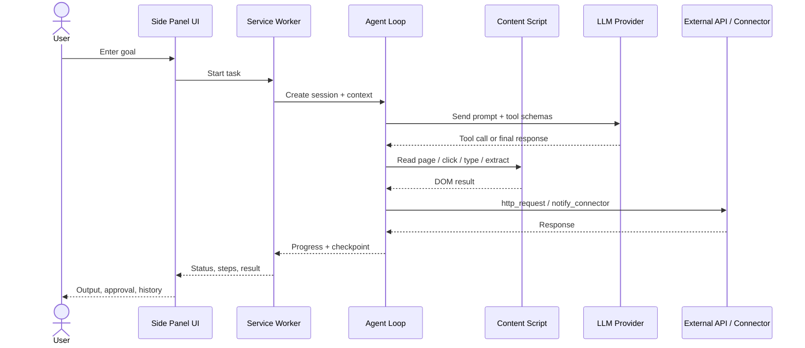

<p align="center">
  
</p>

# BrowseAgent for Chrome

[](https://github.com/KazKozDev/browser-agent-chrome-extension/releases)
[](https://github.com/KazKozDev/browser-agent-chrome-extension/releases/tag/v1.0.3)
[](https://developer.chrome.com/docs/extensions/develop/migrate/what-is-mv3)
[](LICENSE)

AI-powered browser automation in a Chrome side panel. Describe a goal in plain English — BrowseAgent navigates, reads pages, fills forms, calls APIs and routes results to external tools.

Latest stable build: **v1.0.3**

---

## Table of Contents

- [Highlights](#highlights)
- [Overview](#overview)
- [Why I Built It](#why-i-built-it)
- [Screenshot](#screenshot)
- [What It Can Do](#what-it-can-do)
- [Example Scenarios](#example-scenarios)
- [Architecture](#architecture)
- [Tech Stack](#tech-stack)
- [Repository Structure](#repository-structure)
- [Quick Start](#quick-start)
- [Project Status](#project-status)
- [Contributing](#contributing)
- [License and Contact](#license-and-contact)

---

## Highlights

- AI browser agent for real Chrome workflows, not just demos.
- Tool-based execution: navigate, inspect DOM, click, type, extract data, call APIs.
- Human-in-the-loop controls with **Plan mode** and sensitive-action confirmation.
- Background runs, scheduled tasks, session recovery and connector routing.
- Chrome MV3 architecture with automated tests and release-ready packaging.

## Overview

BrowseAgent is a Chrome extension for delegating browser work to an LLM-backed agent. Instead of writing scripts or relying on brittle record-and-replay flows, you describe a goal and the extension executes it through explicit, auditable browser tools.

Designed for operators, growth teams, researchers and engineers who need more flexibility than macros and more control than a hosted cloud agent — with execution staying entirely inside your browser.

## Why I Built It

BrowseAgent started as an experiment in applying generative AI to practical browser automation. The goal was not to "chat with a page", but to build an agent that operates inside Chrome with clear tools, controlled permissions and workflow features that make it usable beyond a toy demo.

Compared with traditional automation it adapts at runtime to natural-language goals. Compared with fully hosted agents it keeps execution close to the browser — useful for DOM interaction, manual approvals and local/private providers such as Ollama.

## Screenshot

**Query:** "Open Wikipedia and find the article about Albert Einstein."


*BrowseAgent opens the Albert Einstein article and returns the result inside the side panel.*

## What It Can Do

- **Navigate** — pages, history, tabs, iframes, back/forward.
- **Read** — accessibility tree, page text, structured data extracted from lists or cards.
- **Interact** — click, type, select, hover, scroll, keyboard shortcuts, form filling.
- **Integrate** — call external APIs; route outputs to Slack, Notion, Airtable, Discord or any webhook.
- **Plan** — preview and approve execution steps before the agent acts.
- **Schedule** — recurring background tasks via `chrome.alarms`; sessions persist across panel restarts.
- **Guard** — site blocklist, sensitive-action confirmation, anti-loop and token-budget limits.

Full tool catalog → [docs/TOOLS.md](docs/TOOLS.md)

## Example Scenarios

- **Research assistant** — search a topic across pages, read results, return a summary.
- **Browser ops** — collect dashboard values and send them to Slack, Airtable or a webhook.
- **Supervised automation** — generate a plan, approve it, then let the agent handle the steps.
- **Scheduled monitoring** — run recurring background checks and notify on completion.

## Architecture

Manifest V3 layout: a **service worker** orchestrates task lifecycle; **content scripts** access the DOM; the **side-panel UI** handles task control and history.



Key decisions: provider abstraction isolates LLM backends behind a common interface for easy swapping; no build step means you can load unpacked, inspect and iterate without a bundler.

## Tech Stack

| Area | Technology |
|---|---|
| Extension platform | Chrome Extension APIs, Manifest V3 |
| Language | JavaScript (ES modules), no build step |
| UI shell | Chrome Side Panel |
| Browser APIs | `chrome.tabs`, `chrome.scripting`, `chrome.alarms`, `chrome.storage`, `chrome.declarativeNetRequest` |
| Model providers | Z.AI, xAI (Grok), Ollama — OpenAI-compatible interface |
| Integrations | Slack, Discord, Notion, Airtable, Google Sheets, email, custom webhook |
| Testing | Node built-in test runner (`node --test`) |

## Repository Structure

```text
src/
├── agent/          Agent loop, reflection, state, safety, completion
├── background/     Service worker, orchestration, alarms, recovery
├── config/         Limits, defaults, shared constants
├── content/        DOM reading, page actions, console/network monitoring
├── integrations/   Delivery adapters for external services
├── providers/      LLM provider implementations and manager
├── sidepanel/      UI: Task, Queue, History, Skills, Connections, Settings
└── tools/          Tool schemas exposed to the model

docs/
├── TOOLS.md             Full tool reference
├── PROVIDERS.md         Provider setup and model selection guide
└── E2E_CHECKLIST.md     Manual release checklist

tests/                   Unit, integration and E2E test suites
```

## Quick Start

**Requirements:** Chrome 114+, one LLM API key (Z.AI or xAI) or a local [Ollama](https://ollama.com/) instance.

```bash
git clone https://github.com/KazKozDev/browser-agent-chrome-extension.git
```

Or [download the latest ZIP](https://github.com/KazKozDev/browser-agent-chrome-extension/raw/main/release/browseagent-v1.0.3-chrome-web-store.zip) and extract it.

1. Go to `chrome://extensions/` → enable **Developer mode** → **Load unpacked** → select `browseagent-ext/`.
2. Open the extension side panel.
3. In **Settings**, choose a provider, enter credentials and click **Test**.
4. Enter a goal in the **Task** view and run it.

Provider setup details (Z.AI, xAI, Ollama) → [docs/PROVIDERS.md](docs/PROVIDERS.md)

### Run tests

```bash
npm test
```

Suites cover planning heuristics, safety guards, anti-loop behavior and completion checks. Manual release checklist: [docs/E2E_CHECKLIST.md](docs/E2E_CHECKLIST.md).

## Project Status

**Public Beta — v1.0.3**

Known limitations: cross-origin iframe control, anti-bot pages, dynamic element IDs after re-render, Ollama performance tied to local hardware.

Roadmap:
- Broader provider coverage and onboarding UX polish.
- Guided workflow templates and example task library.
- Better observability for scheduled and long-running jobs.
- Continued hardening of task recovery and anti-loop behavior.

## Contributing

Bug reports, workflow ideas and pull requests are welcome.

1. Open an issue describing the problem or proposal (include the user problem, not just the implementation idea).
2. Fork, create a focused branch, add or update tests where behavior changes.
3. Submit a pull request with a clear explanation and rationale.

## License and Contact

MIT License — see [LICENSE](LICENSE) · Privacy policy — see [PRIVACY.md](PRIVACY.md)

**Author:** [KazKozDev](https://github.com/KazKozDev) · [LinkedIn](https://www.linkedin.com/in/kazkozdev/) · kazkozdev@gmail.com · [Issues](https://github.com/KazKozDev/browser-agent-chrome-extension/issues)

If this project is useful, a ⭐ on GitHub helps more people find it.