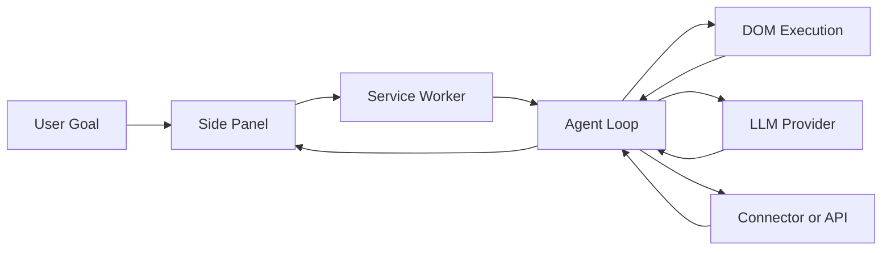

<p align="center">
  
</p>

# BrowseAgent for Chrome

AI browser automation inside Chrome with explicit tool calls, supervised execution, and connector-ready outputs.

[](LICENSE)
[](#testing)
[](https://github.com/KazKozDev/browser-agent-chrome-extension/releases/tag/v1.0.3)
[](https://github.com/KazKozDev/browser-agent-chrome-extension/releases)

## Highlights

- Browser agent for real workflows
- Explicit tools instead of blind scripts
- Plan approval before sensitive execution
- Background runs with session recovery
- Connectors for downstream delivery

## Demo

**Scenario:** `Open Wikipedia and find the article about Albert Einstein.`


## Overview

BrowseAgent is a Chrome Manifest V3 extension that turns plain-English goals into browser actions. It can navigate pages, read the DOM, click through flows, extract structured data, call external APIs, and send results to connected tools. It is built for operators, researchers, growth teams, and engineers who need flexible browser automation without leaving Chrome.

## Motivation

Most browser automation sits in one of two weak categories: brittle scripts or opaque AI agents. Scripts fail when a page changes. Black-box agents hide how they decided to act and make debugging painful. BrowseAgent was built to keep LLM flexibility while forcing execution through explicit, auditable tools, visible run state, and Chrome-native boundaries.

## Features

- Navigate pages, tabs, history, and frames
- Read page text and accessibility-grounded structure
- Click, type, scroll, hover, select, and submit
- Extract structured data from repeated page patterns
- Call external APIs and webhooks during a run
- Route results to Slack, Notion, Airtable, Discord, Telegram, Sheets, email, or custom webhooks
- Preview execution with Plan mode before acting
- Run background jobs with `chrome.alarms`
- Recover unfinished sessions after panel restart
- Enforce blocklists, confirmations, and anti-loop limits

Full tool catalog -> [docs/TOOLS.md](docs/TOOLS.md)

## Architecture

Components:

- `src/background/` - service worker orchestration, alarms, recovery, routing
- `src/content/` - DOM reading and page interaction in browser context
- `src/agent/` - planning, reflection, state, and completion logic
- `src/providers/` - interchangeable OpenAI-compatible LLM backends
- `src/sidepanel/` - task entry, status, approvals, history, settings
- `src/integrations/` - delivery adapters for external destinations

Flow:

User goal -> Side panel -> Service worker -> Agent loop -> Content script / provider / connector -> Result



Architecture detail -> [docs/ARCHITECTURE.md](docs/ARCHITECTURE.md)

## Tech Stack

- JavaScript ES modules
- Chrome Extensions Manifest V3
- Chrome Side Panel API
- `chrome.tabs`, `chrome.scripting`, `chrome.alarms`, `chrome.storage`, `chrome.declarativeNetRequest`
- OpenAI-compatible provider interface
- Node built-in test runner

## Quick Start

1. Open `chrome://extensions/` in Chrome 114 or newer.
2. Enable `Developer mode` and load `browseagent-ext/` as an unpacked extension.
3. Open the side panel and configure a provider in `Settings`.
4. Click `Test` to verify the model connection.
5. Enter a goal in `Task` and run it.

Full provider setup -> [docs/PROVIDERS.md](docs/PROVIDERS.md)

## Usage

Run a simple browser research task:

```text
Open Wikipedia and find the article about Albert Einstein.
```

Run a connector-oriented workflow:

```text
Collect dashboard values from the current tab and send the summary to Slack.
```

Run the automated test suite:

```bash
npm test
```

## Project Structure

```text
src/         agent loop, service worker, content scripts, providers, UI, tools
docs/        architecture, providers, tools, release checklists
tests/       unit, integration, and e2e regression coverage
release/     packaged builds and release bundle contents
```

## Status

- Stage: Public Beta
- Version: 1.0.3
- Planned: broader provider coverage, workflow templates, better long-run observability

## Testing

```bash
npm test
```

## Contributing

- Open an issue with the user problem or workflow gap
- Fork the repository and create a focused branch
- Add or update tests when behavior changes
- Submit a pull request with a clear before/after explanation

---

MIT - see [LICENSE](LICENSE)

If you like this project, please give it a star ⭐

For questions, feedback, or support, reach out to:

[LinkedIn](https://www.linkedin.com/in/kazkozdev/)
[Email](mailto:kazkozdev@gmail.com)
