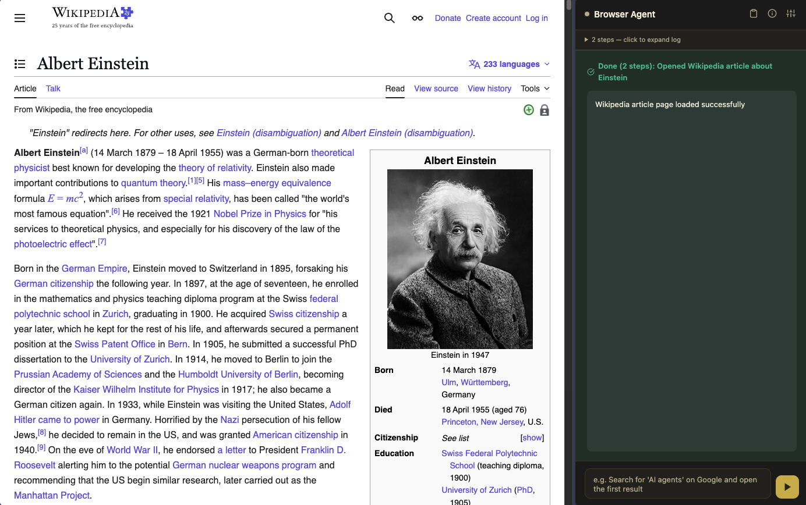
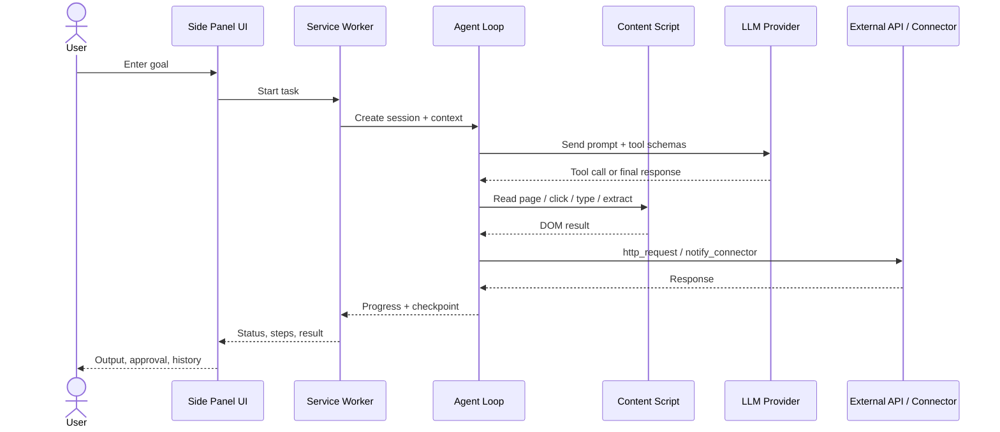

<p align="center">
  
</p>

# BrowseAgent for Chrome

[](https://github.com/KazKozDev/browser-agent-chrome-extension/releases)
[](https://github.com/KazKozDev/browser-agent-chrome-extension/releases/tag/v1.0.3)
[](https://developer.chrome.com/docs/extensions/develop/migrate/what-is-mv3)
[](LICENSE)

AI-powered browser automation in a Chrome side panel. Describe a goal in plain English, and BrowseAgent can navigate, read pages, fill forms, call APIs, and send results to external tools.

Latest stable build: **v1.0.3**

## Table of Contents

- [Highlights](#highlights)
- [Overview](#overview)
- [Why I Built It](#why-i-built-it)
- [Screenshot](#screenshot)
- [What It Can Do](#what-it-can-do)
- [Example Scenarios](#example-scenarios)
- [Architecture Overview](#architecture-overview)
- [Tech Stack](#tech-stack)
- [Repository Structure](#repository-structure)
- [Quick Start](#quick-start)
- [Provider Setup](#provider-setup)
- [Testing and Code Quality](#testing-and-code-quality)
- [Security and Privacy](#security-and-privacy)
- [Project Status and Roadmap](#project-status-and-roadmap)
- [Contributing](#contributing)
- [License](#license)
- [Author and Contact](#author-and-contact)

## Highlights

- AI browser agent for real Chrome workflows, not just demos.
- Tool-based execution: navigate, inspect DOM, click, type, extract data, call APIs.
- Human-in-the-loop controls with **Plan mode** and sensitive-action checks.
- Background runs, scheduled tasks, recovery, notifications and connector routing.
- Chrome MV3 architecture with automated tests and release-ready packaging.

## Overview

BrowseAgent is a Chrome extension for delegating browser work to an LLM-backed agent. Instead of writing scripts or relying on brittle record-and-replay flows, the user describes a goal and the extension executes it through explicit browser tools.

It is designed for people who need more flexibility than macros and more control than a hosted browser agent: operators, growth teams, researchers and engineers exploring agentic UX directly inside the browser.

## Why I Built It

BrowseAgent started as an experiment in applying generative AI to practical browser automation. The goal was not to "chat with a page", but to build an agent that can operate inside Chrome with clear tools, controlled permissions and workflow features that make it usable beyond a toy demo.

Compared with traditional automation, it is optimized for natural-language tasks and adaptation at runtime. Compared with fully hosted agents, it keeps execution close to the browser, which is useful for DOM interaction, tab management, manual approvals and local/private provider options such as Ollama.

## Screenshot

**Query:**  
"Open Wikipedia and find the article about Albert Einstein."



*BrowseAgent opens the Albert Einstein article and returns the result inside the side panel.*

## What It Can Do

### Core capabilities

- Navigate across pages, browser history, tabs and iframes.
- Read pages with accessibility-tree and text extraction tools.
- Interact with forms and controls via click, type, select, hover, scroll and keyboard input.
- Extract structured data from repeated result lists or cards.
- Call external APIs and route outputs to connectors such as Slack, Notion, Airtable or webhooks.

### Workflow features

- **Plan mode** for preview and approval before execution.
- **Scheduled tasks** powered by `chrome.alarms`.
- **Background execution** that continues after the side panel closes.
- **Recoverable sessions** with persisted checkpoints and replayed state.
- **Notifications and history** with task metrics.

### Safety and resilience

- Site blocklist with network-level enforcement.
- Optional tracker and ad blocker during runs.
- Login, CAPTCHA and sensitive-action detection.
- Duplicate-action, SERP-loop and token-budget guards.

The full tool catalog is documented in [docs/TOOLS.md](docs/TOOLS.md).

## Example Scenarios

- Research assistant: open a target site, search for a topic, read results and summarize findings.
- Browser ops: navigate a dashboard, collect values and send them to Slack, Airtable or a webhook.
- Human-supervised automation: generate a plan first, approve it, then let the extension execute routine steps.
- Scheduled monitoring: run recurring checks in the background and notify the user on completion.

## Architecture Overview

BrowseAgent uses a Chrome Extension Manifest V3 layout with a service worker for orchestration, content scripts for DOM access and a side-panel UI for task control.



### Main design decisions

- **Service worker orchestration:** task lifecycle, alarms, recovery and background execution live in `src/background/`.
- **Content-script execution:** DOM reading and interaction stay in `src/content/`, close to the page context.
- **Provider abstraction:** LLM providers are isolated behind a common interface in `src/providers/`.
- **Tool-based agent loop:** the agent operates through explicit browser and integration tools rather than arbitrary page code execution.

## Tech Stack

| Area | Technology |
|---|---|
| Extension platform | Chrome Extension APIs, Manifest V3 |
| Language/runtime | JavaScript (ES modules) |
| UI shell | Chrome Side Panel |
| Browser orchestration | `chrome.tabs`, `chrome.scripting`, `chrome.alarms`, `chrome.storage`, `chrome.declarativeNetRequest`, `chrome.notifications` |
| Agent interface | JSON-schema tool definitions |
| Model providers | Z.AI API, xAI, Ollama, Fireworks compatibility layer |
| Integrations | Slack, Discord, Notion, Airtable, Google Sheets webhook, email/webhook endpoints |
| Testing | Node built-in test runner (`node --test`) |

### Why these choices

- **Manifest V3** keeps the project aligned with the current Chrome extension model.
- **Service worker + content script split** maps cleanly to Chrome's security boundaries.
- **OpenAI-compatible provider pattern** makes it easier to swap hosted and local LLM backends.
- **No build step** keeps the extension easy to inspect, load unpacked and iterate on.

## Repository Structure

```text
src/
├── agent/               Agent loop, reflection, state, safety and completion logic
├── background/          Service worker, orchestration, alarms, routing, recovery
├── config/              Limits, defaults and shared constants
├── content/             DOM reading, page actions, console/network monitoring
├── integrations/        Delivery adapters for external services
├── providers/           LLM provider implementations and manager
├── rules/               Declarative Net Request rulesets
├── sidepanel/           UI for Task, Queue, History, Skills, Connections, Settings
└── tools/               Tool schemas exposed to the model

docs/
├── E2E_CHECKLIST.md     Manual release checklist
└── TOOLS.md             Full tool reference

tests/
├── unit-*.test.js       Agent heuristics, safety, planning and state tests
├── integration-*.test.js Integration behavior tests
└── e2e-*.test.js        Automated end-to-end regression tests
```

## Quick Start

### Requirements

- Chrome **114+**
- One configured LLM provider:
  - Hosted API key for Z.AI or xAI, or
  - Local Ollama instance

### Install for evaluation

1. Clone the repository:

   ```bash
   git clone https://github.com/KazKozDev/browser-agent-chrome-extension.git
   ```

2. Open `chrome://extensions/`.
3. Enable **Developer mode**.
4. Click **Load unpacked**.
5. Select the `browseagent-ext/` folder.
6. Open the extension side panel.
7. In **Settings**, choose a provider, enter credentials, and click **Test**.
8. Enter a goal in the task view and run it.

### Install from release ZIP

1. Download [`browseagent-v1.0.3-chrome-web-store.zip`](https://github.com/KazKozDev/browser-agent-chrome-extension/raw/main/release/browseagent-v1.0.3-chrome-web-store.zip).
2. Extract the archive.
3. Load the unpacked folder in `chrome://extensions/`.

## Provider Setup

### Recommended: Z.AI API

1. Get an API key at [z.ai](https://z.ai/).
2. In Settings, choose the recommended tier.
3. Use model `glm-4.6v`.
4. Set base URL to `https://api.z.ai/api/paas/v4`.

### Budget: xAI

1. Get an API key at [console.x.ai](https://console.x.ai/).
2. Choose the budget tier.
3. Use model `grok-4-1-fast-non-reasoning`.
4. Set base URL to `https://api.x.ai/v1`.

### Free / local: Ollama

1. Install Ollama and run `ollama serve`.
2. Pull a model such as `ollama pull qwen3-vl:8b`.
3. Choose the free tier in Settings.

### Advanced / optional: Fireworks

Fireworks remains available in code/config for compatibility with existing setups.

## Testing and Code Quality

BrowseAgent includes automated tests plus a manual release checklist.

### Run automated tests

```bash
npm test
```

### Quality signals in the repository

- Unit tests for planning, anti-looping, history summaries, snapshots and safety behaviors.
- Integration tests for navigation tools, completion guards and blocked fallbacks.
- Automated E2E coverage for step limits and done-quality checks.
- Manual release verification in [docs/E2E_CHECKLIST.md](docs/E2E_CHECKLIST.md).

## Security and Privacy

### Security

- Site blocklist with default protection for sensitive domains.
- Sensitive-action confirmation for destructive or payment-like flows.
- `http_request` guardrails for schemes, private-network access and credentials in URLs.
- Optional tracker blocking for cleaner, lower-noise pages during runs.

### Privacy

- Privacy policy: [PRIVACY.md](PRIVACY.md)
- Local-provider option via Ollama for privacy-sensitive experimentation.

## Project Status and Roadmap

**Status:** Public Beta

Current limitations:

- Some cross-origin iframes cannot be controlled due to browser security boundaries.
- Anti-bot and heavily protected pages may block automation.
- Dynamic pages can invalidate cached element IDs after re-render.
- Ollama performance depends on local hardware and chosen model size.

Near-term improvements:

- Broader provider coverage and setup UX polish.
- More guided workflow templates and example tasks.
- Better observability around long-running and scheduled jobs.
- Continued hardening of task recovery and anti-loop behavior.

## Contributing

Contributions, bug reports and workflow ideas are welcome.

1. Open an issue describing the bug, use case or proposed change.
2. Fork the repository and create a focused branch.
3. Add or update tests when behavior changes.
4. Submit a pull request with a concise explanation of the change and rationale.

For larger product ideas, include the user problem and expected workflow, not just the implementation detail.

## License

This project is released under the [MIT License](LICENSE).

## Author and Contact

- GitHub: [KazKozDev](https://github.com/KazKozDev)
- LinkedIn: [Artem KK](https://www.linkedin.com/in/kazkozdev/)
- Email: `kazkozdev@gmail.com`
- Issues: [GitHub Issues](https://github.com/KazKozDev/browser-agent-chrome-extension/issues)

If this project is useful, a GitHub star helps more people find it.
